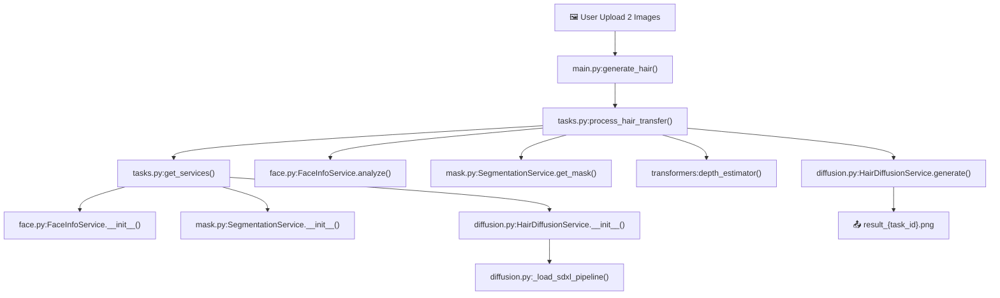
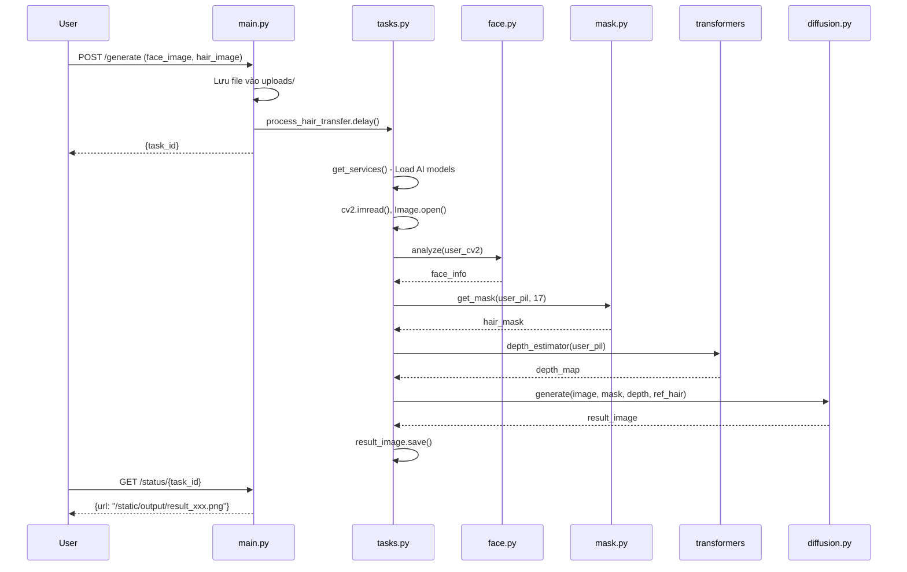

# 🔄 TryHairStyle - Luồng Thực Thi Chi Tiết

Tài liệu mô tả chi tiết luồng chạy từ **hàm nào trong file nào**, từ khi truyền ảnh đầu vào đến hình đầu ra.

---

## 📊 Sơ Đồ Tổng Quan



---

## 📋 Bảng Tổng Hợp Thứ Tự Gọi Hàm

| # | Hàm | File | Dòng | Mục đích |
|:---:|:---|:---|:---:|:---|
| 1 | `generate_hair()` | `backend/app/main.py` | 48-79 | Nhận request, lưu file, trigger Celery |
| 2 | `get_services()` | `backend/app/tasks.py` | 29-50 | Lazy load 3 AI services |
| 3 | `FaceInfoService.__init__()` | `backend/app/services/face.py` | 7-20 | Khởi tạo InsightFace |
| 4 | `SegmentationService.__init__()` | `backend/app/services/mask.py` | 56-68 | Khởi tạo BiSeNet |
| 5 | `HairDiffusionService.__init__()` | `backend/app/services/diffusion.py` | 20-44 | Khởi tạo Diffusion |
| 6 | `_load_sdxl_pipeline()` | `backend/app/services/diffusion.py` | 112-182 | Load SDXL+ControlNet+IP-Adapter |
| 7 | `process_hair_transfer()` | `backend/app/tasks.py` | 52-134 | **Task chính** điều phối |
| 8 | `FaceInfoService.analyze()` | `backend/app/services/face.py` | 22-37 | Detect face |
| 9 | `SegmentationService.get_mask()` | `backend/app/services/mask.py` | 70-98 | Tạo hair mask |
| 10 | `HairDiffusionService.generate()` | `backend/app/services/diffusion.py` | 214-349 | Sinh ảnh AI |

---

## 🔵 CHI TIẾT TỪNG HÀM

---

### **1. `generate_hair()` - API Endpoint**

| File | `backend/app/main.py` |
|:---|:---|
| **Dòng** | 48 → 79 |
| **Mục đích** | Nhận request từ Frontend, lưu file, trigger Celery |

**Input:**
- `face_image: UploadFile` - Ảnh khuôn mặt
- `hair_image: UploadFile` - Ảnh tóc mẫu
- `description: str` - Prompt mô tả
- `use_refiner: bool` - Bật/tắt Refiner

**Logic:**
```python
# Dòng 60-61: Tạo tên file random
face_filename = f"{uuid.uuid4()}_face.{ext}"
hair_filename = f"{uuid.uuid4()}_hair.{ext}"

# Dòng 66-70: Lưu file vào uploads/
with open(face_path, "wb") as f:
    shutil.copyfileobj(face_image.file, f)

# Dòng 73: Trigger Celery Task
task = process_hair_transfer.delay(str(face_path), str(hair_path), description, use_refiner)
```

**Output:** `{"task_id": "abc123...", "status": "QUEUED"}`

---

### **2. `get_services()` - Lazy Load AI Models**

| File | `backend/app/tasks.py` |
|:---|:---|
| **Dòng** | 29 → 50 |
| **Mục đích** | Load models lần đầu tiên, cache cho các task sau |

**Logic:**
```python
# Dòng 36-41: Load 3 services
_SERVICES["face"] = FaceInfoService()      # InsightFace
_SERVICES["mask"] = SegmentationService()  # BiSeNet
_SERVICES["diffusion"] = HairDiffusionService()  # SDXL
```

---

### **3. `FaceInfoService.__init__()` - Khởi tạo InsightFace**

| File | `backend/app/services/face.py` |
|:---|:---|
| **Dòng** | 7 → 20 |
| **Model** | InsightFace `antelopev2` |

**Logic:**
```python
# Dòng 15-19: Khởi tạo FaceAnalysis
self.app = FaceAnalysis(
    name='antelopev2',
    root=model_paths.INSIGHTFACE_ROOT,
    providers=['CUDAExecutionProvider', 'CPUExecutionProvider']
)
self.app.prepare(ctx_id=0, det_size=(640, 640))
```

---

### **4. `SegmentationService.__init__()` - Khởi tạo BiSeNet**

| File | `backend/app/services/mask.py` |
|:---|:---|
| **Dòng** | 56 → 68 |
| **Model** | BiSeNet (19 classes) |

**Logic:**
```python
# Dòng 60-63: Load BiSeNet
self.net = BiSeNet(n_classes=19)
self.net.load_state_dict(torch.load(model_paths.BISENET_CHECKPOINT))
self.net.to(self.device).eval()
```

---

### **5. `HairDiffusionService.__init__()` - Khởi tạo SDXL**

| File | `backend/app/services/diffusion.py` |
|:---|:---|
| **Dòng** | 20 → 44 |

**Logic:**
```python
# Dòng 29-30: Load SDXL pipeline
if self.use_sdxl:
    self._load_sdxl_pipeline()  # → Gọi hàm 6
```

---

### **6. `_load_sdxl_pipeline()` - Load SDXL + ControlNet + IP-Adapter**

| File | `backend/app/services/diffusion.py` |
|:---|:---|
| **Dòng** | 112 → 182 |

**Logic:**
```python
# Dòng 117-121: Load ControlNet Depth
controlnet = ControlNetModel.from_pretrained(model_paths.CONTROLNET_DEPTH)

# Dòng 135-140: Load SDXL Inpaint Pipeline
self.pipe = StableDiffusionXLControlNetInpaintPipeline.from_pretrained(
    model_paths.SDXL_BASE,
    controlnet=controlnet
)

# Dòng 170-175: Load IP-Adapter
self.pipe.load_ip_adapter(
    model_paths.IP_ADAPTER_PLUS_HAIR,
    weight_name="ip-adapter-plus_sdxl_vit-h.bin"
)

# Dòng 181: Chuyển sang GPU
self.pipe.to(self.device, self.dtype)
```

---

### **7. `process_hair_transfer()` - Celery Task Chính**

| File | `backend/app/tasks.py` |
|:---|:---|
| **Dòng** | 52 → 134 |
| **Mục đích** | Điều phối toàn bộ quy trình AI |

**Logic:**
```python
# Dòng 64-66: Load images
user_cv2 = cv2.imread(user_img_path)
user_pil = Image.fromarray(cv2.cvtColor(user_cv2, cv2.COLOR_BGR2RGB))
hair_pil = Image.open(hair_img_path).convert("RGB")

# Dòng 80: Face Analysis
face_info = face_service.analyze(user_cv2)  # → Gọi hàm 8

# Dòng 91: Create Hair Mask
hair_mask = mask_service.get_mask(user_pil, target_class=17)  # → Gọi hàm 9

# Dòng 106-109: Depth Estimation
depth_estimator = pipeline("depth-estimation", model="Intel/dpt-large")
depth_map = depth_estimator(user_pil)['depth']

# Dòng 113-120: Generate Image
result_image = diffusion_service.generate(
    base_image=user_pil,
    mask_image=hair_mask,
    control_image=depth_map,
    ref_hair_image=hair_pil,
    prompt=prompt
)  # → Gọi hàm 10

# Dòng 123-125: Save output
filename = f"result_{self.request.id}.png"
result_image.save(os.path.join(OUTPUT_DIR, filename))
```

---

### **8. `FaceInfoService.analyze()` - Detect Face**

| File | `backend/app/services/face.py` |
|:---|:---|
| **Dòng** | 22 → 37 |

**Logic:**
```python
# Dòng 27: Detect all faces
faces = self.app.get(image_cv2)

# Dòng 32-36: Lấy mặt lớn nhất
faces = sorted(faces, key=lambda x: (x.bbox[2]-x.bbox[0]) * (x.bbox[3]-x.bbox[1]), reverse=True)
return faces[0]
```

**Output:** `face_info` với `.embedding`, `.kps`, `.bbox`

---

### **9. `SegmentationService.get_mask()` - Tạo Hair Mask**

| File | `backend/app/services/mask.py` |
|:---|:---|
| **Dòng** | 70 → 98 |

**Logic:**
```python
# Dòng 77-79: Resize và transform
img_resized = image_pil.resize((512, 512))
img_tensor = self.to_tensor(img_resized).unsqueeze(0).to(self.device)

# Dòng 81-83: BiSeNet inference
with torch.no_grad():
    out = self.net(img_tensor)[0]
    parsing = out.squeeze(0).cpu().numpy().argmax(0)

# Dòng 87-88: Tạo binary mask (class 17 = hair)
mask = np.zeros_like(parsing).astype(np.uint8)
mask[parsing == 17] = 255

# Dòng 94-95: Dilate mask
kernel = np.ones((5,5), np.uint8)
mask_dilated = cv2.dilate(mask, kernel, iterations=2)
```

**Output:** `PIL.Image` - Binary mask (0/255)

---

### **10. `HairDiffusionService.generate()` - Sinh Ảnh AI**

| File | `backend/app/services/diffusion.py` |
|:---|:---|
| **Dòng** | 214 → 349 |

**Logic:**
```python
# Dòng 232-236: Resize tất cả về 1024x1024
image = base_image.resize((1024, 1024))
mask = mask_image.resize((1024, 1024))
control = control_image.resize((1024, 1024))
ref_hair = ref_hair_image.resize((1024, 1024))

# Dòng 243-244: Set IP-Adapter scale
self.pipe.set_ip_adapter_scale(0.6)

# Dòng 272-290: Chuẩn bị arguments
input_args = {
    "prompt": prompt,
    "image": image,
    "mask_image": mask,
    "control_image": control,
    "ip_adapter_image": ref_hair,
    "num_inference_steps": 30,
    "guidance_scale": 7.5,
    "controlnet_conditioning_scale": 0.5,
    "strength": 0.99
}

# Dòng 296: Run inference
result = self.pipe(**input_args).images[0]

# (Optional) Dòng 304-316: Run Refiner nếu use_refiner=True
if use_refiner and self.refiner:
    result = self.refiner(image=result, denoising_start=0.8).images[0]
```

**Output:** `PIL.Image` - Ảnh kết quả 1024x1024

---

## 🔄 Sequence Diagram



---

## ⚠️ Ghi Chú

> **Model Loading:** Models được lazy load lần đầu trong worker process, cache cho các task sau.

> **GPU Memory:** SDXL + ControlNet + IP-Adapter cần ~10GB VRAM. Tắt Refiner nếu thiếu memory.

> **Hair Class:** BiSeNet class 17 = Hair trong CelebAMask-HQ dataset.
