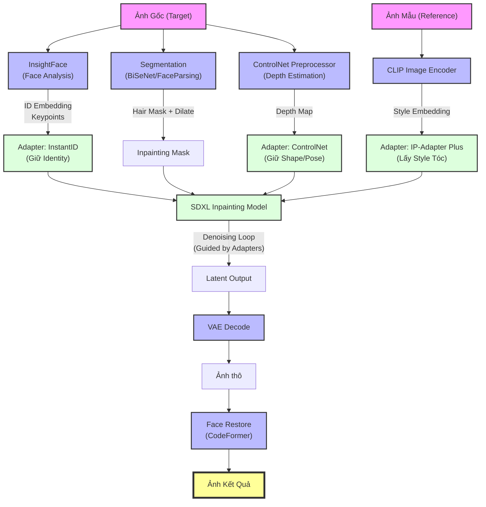

# Quy Trình Xây Dựng Hệ Thống Thay Đổi Kiểu Tóc (Hairstyle Transfer System)

## I. Mục tiêu hệ thống

**Đầu vào:**
*   **Ảnh Target:** Ảnh người dùng (khuôn mặt cần ghép tóc).
*   **Ảnh Reference:** Ảnh mẫu chứa kiểu tóc mong muốn.

**Đầu ra:**
*   Ảnh người dùng với kiểu tóc mới từ ảnh mẫu.

**Yêu cầu giữ nguyên:**
*   Identity (Danh tính) khuôn mặt.
*   Hướng nhìn (Gaze).
*   Ánh sáng (Lighting).
*   Background (Phông nền).

---

## II. Tech Stack & Môi trường

| Thành phần | Công nghệ / Model |
| :--- | :--- |
| **Base Model** | **SDXL** (Stable Diffusion XL) |
| **Face Analysis** | **InsightFace** (buffalo_l) → Trích xuất ID Embedding |
| **Segmentation** | **BiSeNet-v2** hoặc **FaceParsing.PyTorch** → Tách Mask (Tóc, Mặt, Cổ) |
| **Adapter (Identity)** | **InstantID** → Giữ khuôn mặt mạnh mẽ |
| **Adapter (Style)** | **IP-Adapter Plus** → Transfer kiểu tóc (Style/Reference) |
| **Profile Alignment** | **3DDFA_V2** → Căn chỉnh 3D cho góc nghiêng lớn (>45°) |
| **ControlNet** | **ControlNet Depth** → Giữ cấu trúc đầu |

---

## III. Preprocessing (Tiền xử lý)

1.  **Alignment:**
    *   **Frontal Face (<45°):** Căn chỉnh 2D dựa trên 5 điểm (mắt, mũi, miệng).
    *   **Profile Face (>45°):** Căn chỉnh 3D (3DDFA_V2) + Roll Correction để giữ nguyên góc nghiêng tự nhiên.
2.  **Normalization:** Chuẩn hóa kích thước ảnh (Target Size: 1024x1024 cho SDXL).
3.  **Masking (Tách nền/bộ phận):**
    *   Tách riêng các vùng: `hair` (tóc), `face` (mặt), `neck` (cổ), `background` (nền).
    *   Tạo **Inpainting Mask** = Vùng tóc gốc + Dilate (mở rộng vùng biên) để tóc mới mọc tự nhiên.

---

## IV. Kiến trúc mô hình (Dual-Conditioning)

Hệ thống sử dụng cơ chế điều kiện kép để cân bằng giữa việc giữ mặt và đổi tóc.

### 1. Nhánh giữ Identity (Face Preservation)
*   **Input:** Ảnh Target (Mặt người).
*   **Models:**
    *   `InsightFace` → Lấy `id_embedding`.
    *   `InstantID` → Nhận `id_embedding` để điều hướng SDXL giữ nét mặt.
    *   `ControlNet Depth` → Giữ hình khối đầu, vai, tư thế (Pose).

### 2. Nhánh truyền Style (Hair Transfer)
*   **Input:** Ảnh Reference (Tóc mẫu).
*   **Models:**
    *   `IP-Adapter Plus` → Encode ảnh Reference để lấy `style_embedding` (Texture, mảng khối tóc, độ phồng).

### 3. Cơ chế Inpainting
*   Chỉ sinh ảnh lại trong vùng **Mask Tóc**.
*   Giữ nguyên pixel của vùng mặt và background gốc.

---

## V. Chiến lược Huấn luyện (Training Strategy) - *Optional/Advanced*

Nếu model có sẵn chưa đủ tốt, thực hiện training 2 giai đoạn:

*   **Giai đoạn 1: Finetune IP-Adapter (Hair-Encoder)**
    *   **Data:** Dataset K-Hairstyle.
    *   **Mục tiêu:** Giúp model hiểu sâu về texture tóc (xoăn, thẳng, nhuộm).
*   **Giai đoạn 2: Inpainting (Identity Preservation)**
    *   **Data:** FFHQ.
    *   **Task:** Tự xóa tóc ảnh gốc và yêu cầu model vẽ lại chính xác dựa trên ID Embedding.

---

## VI. Inference Pipeline (Quy trình chạy thật)

1.  **Preprocessing:**
    *   `Target Image` → **BiSeNet** → Mask Tóc cũ + Mask Cổ/Vai.
    *   `Target Image` → **ControlNet Preprocessor** → Depth Map.
    *   `Target Image` → **InsightFace** → ID Embedding.

2.  **Encoding:**
    *   `Reference Image (Tóc)` → **CLIP Image Encoder** → Style Embedding.

3.  **Generation (SDXL Inpainting):**
    *   **Prompt:** "a photo of a person with [description of hair], high quality..."
    *   **Negative Prompt:** "bald, low quality, artifact, deformed face..."
    *   **Conditions:**
        *   `InstantID (ID)`: Weight **0.7**
        *   `IP-Adapter Plus (Style)`: Weight **1.0**
        *   `ControlNet Depth`: Weight **0.6** (Giảm nhẹ để tóc mới có thể phồng/xẹp khác tóc cũ).
    *   **Inpainting:** Chỉ vẽ vào vùng Mask.

4.  **Post-processing:**
    *   **Face Restore:** Dùng CodeFormer/GFPGAN nếu mặt bị nhòe.
    *   **Blending:** Làm mượt vùng biên (feathering) giữa tóc mới và trán.

---

## VII. Triển khai (Deployment)

*   **Backend:** FastAPI (Python). Xử lý Heavy AI Tasks.
    *   Sử dụng **Celery + Redis** cho hàng đợi (Task Queue) để xử lý bất đồng bộ (tránh timeout).
*   **Frontend:** ReactJS (Vite) + TailwindCSS.
    *   Tính năng: Upload ảnh, chọn mẫu tóc, vẽ mask thủ công (Brush tool) để sửa vùng tóc nếu AI nhận diện sai.

---

## VIII. Sơ đồ Pipeline (Flowchart)

