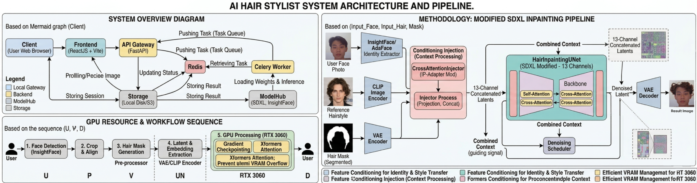
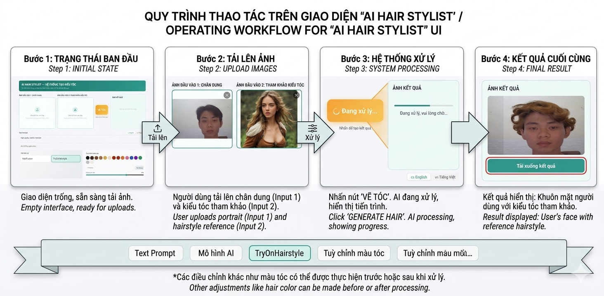

# TryHairStyle

[](https://github.com/Phatjhhoq8/TryHairstyle_Diffusion)

Ứng dụng thử kiểu tóc ảo bằng AI sử dụng **Stable Diffusion XL Inpainting**, **ControlNet**, **IP-Adapter**, **InstantID** và **SegFormer**.

### 🖼️ Mô phỏng hệ thống (Simulation Demo)





> [!NOTE]
> Repo này **không** commit virtual environment, model weights, dữ liệu sinh ra và `.env`.
> Sau khi clone, bạn cần tự tạo lại môi trường và tải model (xem hướng dẫn bên dưới).

---

## Mục lục

1. [Yêu cầu hệ thống](#1-yêu-cầu-hệ-thống)
2. [Cài đặt & Khởi chạy toàn bộ hệ thống](#2-cài-đặt--khởi-chạy-toàn-bộ-hệ-thống)
3. [Chạy bằng Docker](#3-chạy-bằng-docker)
4. [Cấu trúc mã nguồn chi tiết](#4-cấu-trúc-mã-nguồn-chi-tiết)
5. [API chính](#5-api-chính)
6. [Kiểm thử & Debug](#6-kiểm-thử--debug)
7. [Troubleshooting](#7-troubleshooting)
8. [Trọng số Model & Dataset tham khảo](#8-trọng-số-model--dataset-tham-khảo)
9. [Chi tiết File trung gian (Output)](#9-chi-tiết-file-trung-gian-output)
10. [Danh sách Model Lõi (Core Models)](#10-danh-sách-model-lõi-core-models)
11. [Model phụ](#11-model-phụ)

---

## 1. Yêu cầu hệ thống

### Phần cứng

| Thành phần | Yêu cầu |
|---|---|
| **GPU** | NVIDIA ≥ 12 GB VRAM (Khuyến nghị RTX 3060 trở lên) |
| **RAM** | ≥ 16 GB |
| **Ổ đĩa** | ≥ 20 GB trống |

### Phần mềm

| Phần mềm | Ghi chú |
|---|---|
| **Python 3.10 / 3.11** | Chạy Backend |
| **Node.js 18+** | Chạy Frontend (React/Vite) |
| **Redis** | Message broker xử lý hàng đợi cho Celery |
| **WSL2 (Ubuntu)** | Bắt buộc nếu dùng Windows để chạy Backend AI |
| **CUDA 12.1** | Để PyTorch nhận diện được GPU |

---

## 2. Cài đặt & Khởi chạy toàn bộ hệ thống

Hệ thống được thiết kế tối ưu nhất khi **Backend chạy trên WSL2 (Linux)** để tận dụng đầy đủ thư viện AI và **Frontend chạy trên Windows**.

### Bước 1 – Clone & cấu hình biến môi trường

Mở terminal (WSL hoặc PowerShell):

```bash
git clone https://github.com/Phatjhhoq8/TryHairstyle_Diffusion
cd TryHairStyle
cp .env.example .env          # Cập nhật HUGFACE_TOKEN nếu cần trong file .env
```

### Bước 2 – Tải & cài đặt Model AI

Trên WSL2/Linux, tạo môi trường ảo và tải models:

```bash
python3 -m venv venv_wsl && source venv_wsl/bin/activate
pip install torch torchvision torchaudio --index-url https://download.pytorch.org/whl/cu121
pip install -r backend/requirements.txt

mkdir -p backend/models backend/data
python download_models.py      # Tự động tải SDXL, InsightFace, ControlNet...
```

### Bước 3 – Khởi chạy hệ thống đồng loạt (Cách khuyên dùng)

Dự án đã có sẵn script `start.sh` để tự động khởi chạy khép kín chuỗi Redis, FastAPI và Celery Worker. 

**Khởi chạy Backend (trên WSL2):**
Mở terminal WSL2 tại thư mục gốc của dự án và chạy lệnh sau:

```bash
wsl -e bash start.sh
```

*Script sẽ tự động thực hiện 3 tác vụ ngầm:*
1. Start `redis-server` ở port `6379`.
2. Start API Server `FastAPI` ở port `8000`.
3. Start `Celery worker` để xử lý các AI task nặng.
*(Ghi chú: Nhấn Ctrl+C trong màn hình WSL này sẽ tắt an toàn toàn bộ Backend services).*

**Khởi chạy Frontend (trên Windows PowerShell):**
Mở một cửa sổ PowerShell mới quản lý riêng rẽ, di chuyển đến thư mục dự án và chạy:

```powershell
cd frontend
npm install
npm run dev
```

**Địa chỉ truy cập thiết yếu sau khởi chạy:**
- **Giao diện người dùng (Frontend):** `http://localhost:5173`
- **Backend API Docs (Swagger):** `http://localhost:8000/docs`

---

## 3. Chạy bằng Docker

> [!IMPORTANT]
> Cần tải model qua `download_models.py` trước khi build Docker vì container có thiết lập chỉ mount thư mục cứng `./backend/models` vào để tránh việc bị phình dung lượng image.

```bash
docker compose up --build -d
docker compose logs -f backend  # Cuộn log để theo dõi Server Status
```
*Truy cập Frontend ở cổng dự phòng `http://localhost:3000` theo cấu hình docker compose.*

---

## 4. Cấu trúc mã nguồn chi tiết

Dưới đây là sơ đồ chi tiết về các thư mục và kịch bản lõi hỗ trợ tạo nên hệ thống:

```text
TryHairStyle/
├── backend/                  # Toàn bộ mã nguồn logic máy học và cấu hình API
│   ├── app/
│   │   ├── main.py           # Entry point của FastAPI, định nghĩa các API routes chính (như Upload, Generate, API Status).
│   │   ├── config.py         # Nơi quản lý biến môi trường, định nghĩa đường dẫn tải model/output global.
│   │   ├── schemas.py        # Định dạng dữ liệu vào/ra bằng Pydantic model để validation dữ liệu API.
│   │   ├── tasks.py          # Khai báo Celery Worker, đóng vai trò như pipeline điều phối các tác vụ bất đồng bộ nặng (như ghép tóc, đổi màu).
│   │   ├── services/         # Thư mục sức mạnh chứa logic "trái tim" xử lý AI của hệ thống:
│   │   │   ├── diffusion.py  # Script cấu hình pipeline Stable Diffusion (SDXL + IP-Adapter + ControlNet). Nhận prompt và sinh ảnh diffusion.
│   │   │   ├── face.py       # Gọi mô hình nhận diện danh tính khuôn mặt bằng InsightFace và InstantID Embedder.
│   │   │   ├── face_detector.py # Mở rộng tách tự động và dò khuôn mặt trong 1 bức ảnh chụp tập thể lớn.
│   │   │   ├── mask.py       # Tích hợp Auto SegFormer nhận diện và cắt phần lõi (tóc/đầu) để tạo inpainting mask độc quyền cho SDXL vẽ đè vào.
│   │   │   ├── hair_color_service.py # Core logic xử lý đổi màu tóc trực tiếp không cần thay đổi style dáng tóc thông qua openCV.
│   │   │   ├── pose_estimator.py   # Code trích xuất góc nghiêng 2D, khung xương hàm (trường hợp chụp góc nghiêng).
│   │   │   ├── reconstructor_3d.py # Code kích hoạt giải thuật 3DDFA căn chỉnh tự động hình dạng mặt 3D bảo toàn góc nghiêng.
│   │   │   ├── translate_service.py# Mini module xử lý dịch NLP mượt qua API từ Prompt Tiếng Việt sang Tiếng Anh.
│   │   │   └── visualizer.py # Utility nội bộ để hiển thị, và in layer thông tin ghép thành mask overlay báo lỗi debug trong quá trình model sinh ảnh.
│   │   └── utils/            # Các function đa năng đóng gói phụ trợ IO (đọc/ghi file pixel, JSON logs).
│   ├── tests/                # Chứa script dùng test chay logic hệ thống AI Pipeline mà không cần bật Web Server FastAPI.
│   ├── requirements.txt      # Gói Package cấu hình hệ điều hành Backend Python.
│   └── Dockerfile            # Cấu hình container đóng gói thiết lập Cuda Backend riêng.
├── frontend/                 # Mã nguồn giao diện Web Frontend viết bằng kiến trúc React + Vite
│   ├── src/
│   │   ├── App.jsx           # Component Root của toàn bộ ứng dụng, nắm Context State chính và chứa khối Master Layout.
│   │   ├── main.jsx          # Cấu hình Bootstrap mount React component đầu tiên vào khối DOM gốc.
│   │   ├── index.css         # Chức cấu hình module TailwindCSS và style CSS variables chung cho diện mạo Website.
│   │   ├── components/       # Các module UI Blocks chia nhỏ phục trách hiển thị:
│   │   │   ├── ImageUpload.jsx  # Component tạo giao diện Card Dropzone Upload thao tác ảnh kéo thả.
│   │   │   ├── ResultPanel.jsx  # Card chuyên render hiển thị kết quả xử lý ảnh trả lại từ Backend API.
│   │   │   ├── FaceSelector.jsx # Tool logic mở rộng cho người dùng hỗ trợ crop/chọn vùng mặt đầu vào tùy ý khi có nhiều gương mặt.
│   │   │   ├── PromptBuilder.jsx / PromptInput.jsx # Components hiển thị giao diện tuỳ chỉnh tham số text-to-image tùy ý và prompt keywords.
│   │   │   ├── ColorPicker.jsx  # Khối giao diện hiển thị bảng chọn màu cho tính năng nhuộm nhanh và UI thanh kéo Color Intensity.
│   │   │   └── DrawButton.jsx   # Nút thao tác mở rộng UI mask tool hỗ trợ.
│   ├── package.json          # File kê khai Node packages thư viện cần tải và chỉ dẫn câu lệnh npm dev/build phía Nodejs.
├── start.sh                  # Kịch bản Bash hỗ trợ tự động kích hoạt Environment, Redis, Uvicorn Server và Celery Worker chỉ bằng một phím bấm.
├── download_models.py        # Tập lệnh python độc lập tự động scan HuggingFace và tải về các file pre-trained weights `.safetensors` nặng thiếu.
├── split_dataset.py          # Kịch bản hỗ trợ Data Analyst xử lý chia train/test/val phân vùng dataset nếu người dùng tiến hành huấn luyện Deep Learning tự ý lại đồ án.
└── docker-compose.yml        # Định nghĩa orchestrator chạy Redis-Backend-Frontend khép kín với Virtual Network duy nhất trên Docker Desktop.
```

---

## 5. API chính

| Method | Endpoint | Mô tả chức năng |
|---|---|---|
| `POST` | `/generate` | Upload ảnh gốc + ảnh tóc, bắt đầu tiến trình sinh ảnh ngầm trong Celery, trả `task_id`. |
| `POST` | `/detect-faces` | Tự động phát hiện khuôn mặt để crop (cho ảnh đông người). |
| `POST` | `/colorize` | Gọi thẳng logic nhuộm màu tóc cho người thật mà không dùng model diffusion, rất nhanh. |
| `GET` | `/status/{task_id}` | Polling API lấy liên tục tiến độ phần % xử lý ảnh từ Redis Database để react theo luồng thời gian thực. |
| `GET` | `/random-pair` | Developer Mode: Lấy 2 cặp ảnh ngẫu nhiên trong dataset đã cung cấp lưu tại tĩnh /static. |

---

## 6. Kiểm thử & Debug

Chạy lệnh kiểm tra tính hợp lệ của thư viện `torch` CUDA nhận diện GPU trước khi tính toán tác vụ diffusion sinh ảnh nặng nề:

```bash
python -c "import torch; print('PyTorch:', torch.__version__); print('CUDA:', torch.cuda.is_available())"
```

**Chạy kiểm thử logic cốt lõi bằng Terminal Console:**
Đôi khi hệ thống Frontend/Redis bị lỗi, bạn có thể skip Web Application để tập trung gọi chay logic ghép AI Inpainting:

```bash
python backend/tests/test_cli_ffhq.py
```

---

## 7. Troubleshooting (Xử lý các lỗi ngoại lệ)

| Triệu chứng phổ biến | Phân tích nguyên nhân & Hướng giải quyết |
|---|---|
| Báo lỗi Server `Internal Server Error` do không tìm thấy file Model Weights khi chạy test thử ảnh | Do repo Github ban đầu tự động chặn bỏ `.gitignore` model AI lớn, bạn chưa chạy file tải hệ thống Neural Network. **Khắc phục:** Mở console chạy lệnh phụ: `python download_models.py` để kéo file đầy đủ nhất. |
| Frontend liên tục Spinning mà Network Log không gọi được xuống API Server phía sau | Nguyên do Backend port chưa được Listening. **Khắc phục:** Mở check status xem FastAPI đã chạy chưa qua route check sức khỏe `http://localhost:8000/docs`, đặc biệt tra kĩ cổng 8000 có bị App chạy đè gây crash không. |
| Sau khi load 100%, Task tiến trình chuyển sang dạng _Pending / Treo mãi mãi_ | Do AI Worker Celery phía sau đã ngủ yên/chưa được gọi kích hoạt dù Frontend/Backend Controller đã tiếp nhận Upload Image. **Khắc phục:** Tab sang Windows WSL và chắc chắn đã khởi chạy `celery -A backend.app.tasks.celery_app worker...` hoặc đã run bash `start.sh` cho tự động hoàn toàn. Chắc chắn Redis Server đang Running theo. |
| Chạy nửa chừng vỡ Terminal do Terminal đỏ rực in cảnh báo (CUDA Out of Memory - OOM Error) | Do VRAM GPU vật lý Card đồ hoạ quá thấp, bị vượt quá VRAM dung cấp do SDXL Controlnet quá ngốn RAM Video. **Khắc phục:** Mặc định SDXL target tensor `1024x1024`. Bạn hãy thử hạ kích thước sinh ảnh xuống để chừa khoảng thở bộ nhớ cấu hình. |

---

## 8. Trọng số Model & Dataset tham khảo

**Đường dẫn tải trọng số hệ thống (Model Weights):**
- [Hugging Face - TryHairStyle Weights](https://huggingface.co/datasets/halogenbr/tryhairstyle) - Nơi lưu trữ các trọng số pre-trained cần thiết để chạy hệ thống AI.

Dataset quy chuẩn khuyến nghị để đào tạo/fine-tuning model nhánh IP-Adapter tùy ý (Nếu User muốn mở rộng phát triển riêng đề tài):
- **FFHQ High-Quality Faces:** [Google Drive FFHQ Download](https://drive.google.com/drive/folders/1tZUcXDBeOibC6jcMCtgRRz67pzrAHeHL) - Tập ảnh cấu trúc khuôn mặt rõ nét của Nvidia cho Generator.
- **K-Hairstyle Reference Original:** [K-Hairstyle Asian Project Repo Download](https://psh01087.github.io/K-Hairstyle/) - Tập thư viện mảng tóc/cấu trúc khối đa dạng kiểu cách tóc Hàn Quốc.

---

## 9. Chi tiết File trung gian (Output)

Mỗi session xử lý AI sẽ tạo ra thư mục làm việc tĩnh tại đường dẫn `backend/data/output/session_XXXXXXXX/` chứa các cấu trúc:

| Thư mục / File | Mô tả |
|---------|-------|
| `images/` | Ảnh đầu vào đã tự động crop về chuẩn 1024x1024 |
| `mask_hair/` | Mask nhị phân trích xuất vùng tóc (để inpainting khu vực tóc mới) |
| `mask_face/` | Mask nhị phân trích xuất định dạng vùng mặt gốc |
| `nth/` | Hình ảnh render trực quan lưới điểm Facial Landmarks |
| `agnostic/` | Ảnh đã qua quá trình xóa tóc cũ (Agnostic Image) chỉ giữ lại khuôn mặt thuần |
| `agnostic-mask/` | Mask tổng quát định vị khoanh vùng bao quanh khuôn mặt và tóc thay thế |
| `keypoints/` | File văn bản lưu dữu liệu tọa độ landmarks vector dạng text |
| `result.png` | **Ảnh kết quả cuối cùng đã ghép và sinh thành công** |

---

## 10. Danh sách Model Lõi (Core Models)

Nếu cơ chế tự động cài đặt qua file script gặp sự cố, bạn có thể kiểm tra trực tiếp và bổ sung để đảm bảo thư mục `backend/models/` có mặt các weight files trọng yếu sau (những mô hình này không thuộc bộ SDXL tải từ HuggingFace):

| Tệp Model Weights | Dung lượng | Chức năng thành tố |
|------|-----------|------|
| `face_segment16.pth` | ~51 MB | Mô hình SegFormer cô lập ranh giới Semantic Segmentation cho khung tóc và đầu người thật. |
| `shape_predictor_68_face_landmarks.dat` | ~95 MB | Mô hình Predictor sử dụng nền thư viện dlib cho trích xuất landmark mặt nhanh. |
| `realisticVisionV60B1_v51VAE.safetensors` | ~1.9 GB | VAE Decoder có chức năng tinh chỉnh các chi tiết da mặt, làm sắc nét ảnh đầu ra sau khi SDXL hoàn thành inpainting. |

---

<details>
<summary><h2>Model phụ</h2></summary>

## Yêu cầu hệ thống

- **Python** 3.10/ 3.11
- **CUDA** 11.7+ và GPU NVIDIA (khuyến nghị ≥ 8GB VRAM)
- **Linux / WSL2** (Ubuntu 20.04+)
- **CMake** và **build-essential** (để build dlib)


## Cài đặt

### Cách 1: Dùng venv (khuyến nghị)

```bash
# 1. Tạo Virtual Environment
python3.8 -m venv hairfusion
source hairfusion/bin/activate

# 2. Cài PyTorch + CUDA 11.7
pip install torch==2.0.0+cu117 torchvision==0.15.1+cu117 --index-url https://download.pytorch.org/whl/cu117

# 3. Cài CMake (cần thiết để build dlib)
sudo apt-get update && sudo apt-get install -y cmake build-essential

# 4. Cài tất cả dependencies
pip install -r requirements.txt
```

### Cách 2: Dùng Conda

```bash
conda create -y -n hairfusion python=3.8
conda activate hairfusion
pip install torch==2.0.0+cu117 torchvision==0.15.1+cu117 --index-url https://download.pytorch.org/whl/cu117
pip install -r requirements.txt
```

### Cách 3: Dùng Docker (đơn giản nhất)

**Yêu cầu:** [Docker](https://docs.docker.com/get-docker/) + [NVIDIA Container Toolkit](https://docs.nvidia.com/datacenter/cloud-native/container-toolkit/install-guide.html)

```bash
# Build và chạy
docker-compose up --build

# Chạy nền
docker-compose up -d --build
```

Mở trình duyệt tại `http://localhost:7860`. Kết quả lưu trong `backend/data/output/`.


## Tải Model Weights

### 1) Preprocessing Models (bắt buộc)
Tải và lưu vào `backend/models/`:

| File | Kích thước | Link |
|------|-----------|------|
| `face_segment16.pth` | 50.8 MB | [Google Drive](https://drive.google.com/file/d/10GL030sNpVrxM9Ez0nXhHvs9-lsnZFGV/view?usp=sharing) |
| `shape_predictor_68_face_landmarks.dat` | 95.1 MB | [Google Drive](https://drive.google.com/file/d/1g4jTab8cNVmF2AjDz2N3uXu0cMvsvlC3/view?usp=sharing) |

### 2) VAE Model (bắt buộc)
- Tải `realisticVisionV60B1_v51VAE.safetensors` (~2GB) từ [CivitAI](https://civitai.com/models/4201?modelVersionId=130072)
- Lưu vào `backend/models/`

### 3) HairFusion Checkpoint (bắt buộc)
- Tải [hairfusion.zip (8.4GB)]
- Giải nén và lưu vào `backend/logs/`

### Cấu trúc thư mục sau khi tải:
```
backend/
├── models/
│   ├── face_segment16.pth
│   ├── shape_predictor_68_face_landmarks.dat
│   └── realisticVisionV60B1_v51VAE.safetensors
└── logs/
    └── hairfusion/
        └── models/
            └── [Train]_[epoch=599]_[train_loss_epoch=0.3666].ckpt
```


## Chạy hệ thống

### Web UI (Gradio)

```bash
source hairfusion/bin/activate
export LD_LIBRARY_PATH=/usr/lib/wsl/lib:/usr/local/cuda/lib64:$LD_LIBRARY_PATH
python -m backend.app.main
```

Mở trình duyệt tại `http://localhost:7860` để sử dụng giao diện.

**Hướng dẫn sử dụng:**
1. Upload ảnh khuôn mặt (Your Face)
2. Upload ảnh kiểu tóc mong muốn (Desired Hairstyle Reference)
3. Điều chỉnh Steps (mặc định 50) và Guidance Scale (mặc định 5.0)
4. Bấm **Generate**
5. Kết quả + file trung gian được lưu trong `backend/data/output/session_XXXXXXXX/`

### CLI Inference (Script gốc)

```bash
bash ./scripts/test.sh
```

## File trung gian (Output)

Mỗi session sẽ tạo thư mục `backend/data/output/session_XXXXXXXX/` chứa:

| Thư mục | Mô tả |
|---------|-------|
| `images/` | Ảnh đầu vào đã crop |
| `mask_hair/` | Mask vùng tóc |
| `mask_face/` | Mask vùng mặt |
| `nth/` | Keypoints visualization |
| `agnostic/` | Ảnh agnostic (giữ mặt, xoá tóc) |
| `agnostic-mask/` | Mask vùng agnostic |
| `keypoints/` | Toạ độ facial landmarks |
| `result.png` | **Ảnh kết quả cuối cùng** |

</details>
