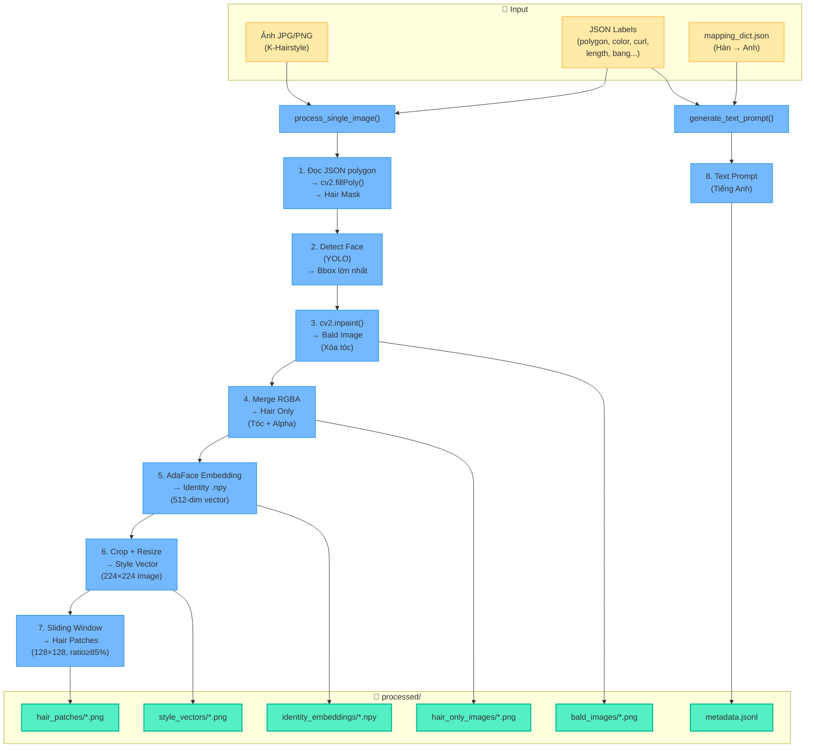
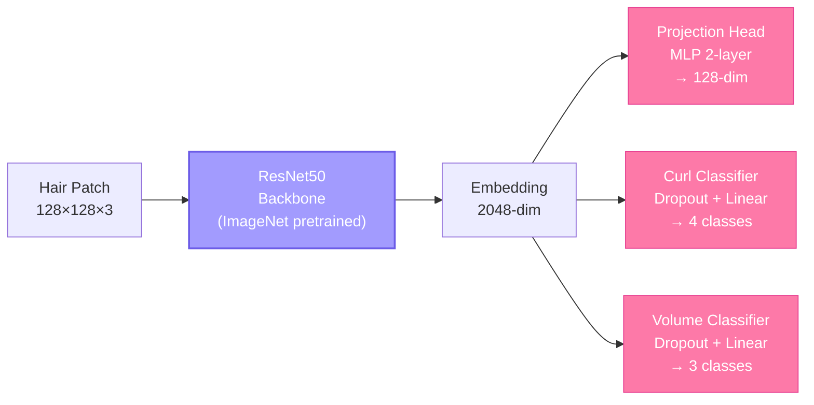
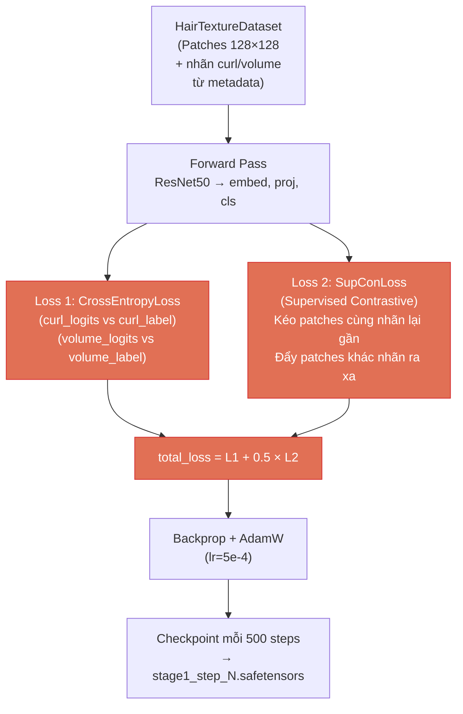
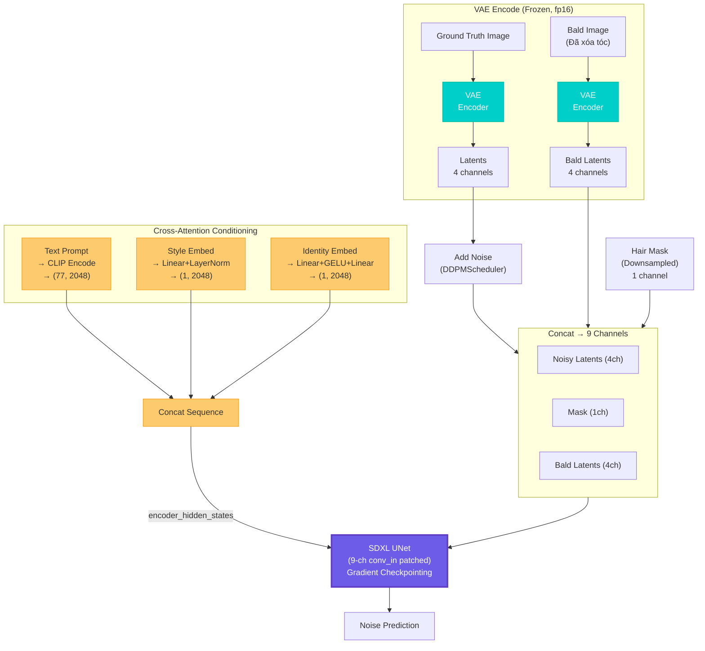
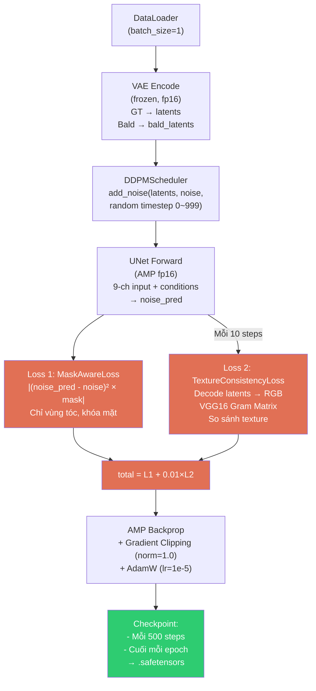
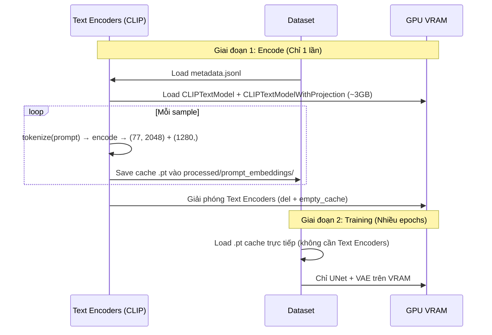
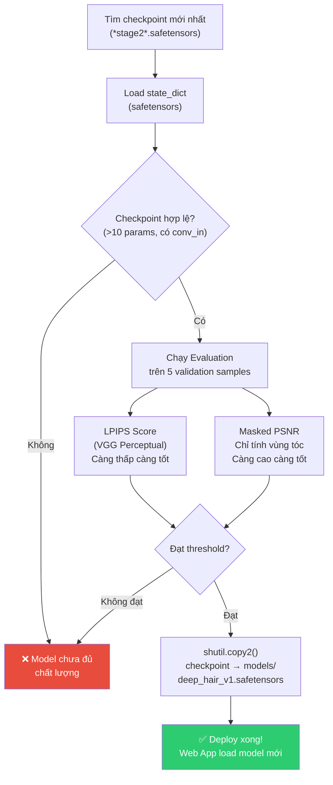
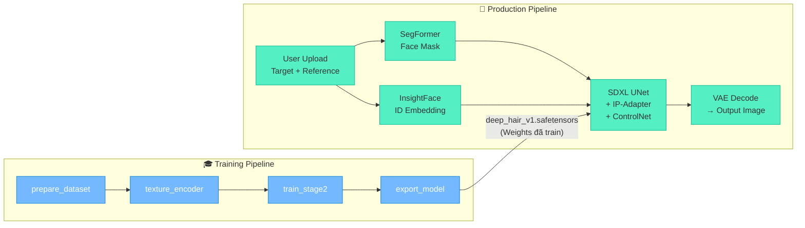

# Hoạt Đồ Hệ Thống Huấn Luyện (Training Pipeline)

## I. Tổng Quan Pipeline

Pipeline huấn luyện gồm **4 Giai đoạn** (Stages) chạy tuần tự, mỗi giai đoạn phụ thuộc đầu ra của giai đoạn trước.


**File điều phối:** `run_training_pipeline.sh` — chạy lần lượt 4 lệnh Python.

---

## II. Stage 0 — Chuẩn Bị Dataset

**File:** `prepare_dataset_deephair.py`

### Mục tiêu
Chuyển đổi ảnh raw + JSON labels (K-Hairstyle) thành các tensor/ảnh sẵn sàng cho training.

### Hoạt đồ chi tiết



### Đa luồng
`ProcessPoolExecutor` (tối đa 8 workers) xử lý song song nhiều ảnh, mỗi worker khởi tạo riêng YOLO detector + AdaFace embedder.

---

## III. Stage 1 — Hair Texture Encoder

**File:** `models/texture_encoder.py`

### Mục tiêu
Huấn luyện mạng **ResNet50** để "hiểu" texture tóc: xoăn/thẳng, dày/mỏng, lọn/sợi.

### Kiến trúc Model



### Quá trình Training



### Nhãn phân loại (từ text_prompt metadata)

| Curl (4 classes) | Volume (3 classes) |
|---|---|
| 0 = straight (thẳng) | 0 = low (ít) |
| 1 = wavy (vểnh) | 1 = normal (bình thường) |
| 2 = curly (xoăn) | 2 = high (nhiều) |
| 3 = tightly curly (xoăn tít) | |

---

## IV. Stage 2 — Mask-Conditioned Hair Inpainting (Core)

**Files:** `train_stage2.py`, `models/stage2_unet.py`

### Mục tiêu
Fine-tune UNet SDXL để vẽ tóc mới vào vùng mask, giữ nguyên khuôn mặt.

### Kiến trúc UNet 9-Channel



### Luồng Training 1 Step



### VRAM Budget (GPU 12GB — RTX 3060)

| Component | VRAM | Ghi chú |
|---|---|---|
| UNet (fp16) | ~5 GB | Gradient checkpointing + xformers ON |
| VAE (fp16, frozen) | ~0.5 GB | Chỉ encode, enable_slicing() |
| Text Encoders | **0 GB** | Encode xong → giải phóng |
| Optimizer states | ~2.5 GB | 8-bit AdamW (bitsandbytes) |
| Activations + Gradients | ~3-4 GB | AMP fp16 + xformers + grad accumulation |
| **Tổng ước tính** | **~10-11 GB** | Fit trong 12GB ✅ |

> **Kỹ thuật tối ưu đã áp dụng:**
> - xformers memory-efficient attention
> - 8-bit AdamW optimizer (bitsandbytes)
> - VAE slicing (encode/decode từng slice)
> - Gradient Accumulation (4 steps)
> - Texture Loss giảm tần suất (mỗi 50 steps)

### Pre-encode Workflow (Text Prompts)



---

## V. Stage 3 — Evaluate & Export

**Files:** `evaluate.py`, `export_model.py`

### Hoạt đồ



### Metrics giải thích

| Metric | Công thức | Ý nghĩa |
|---|---|---|
| **LPIPS** | VGG features distance (crop vùng tóc) | Đo sự khác biệt thị giác giữa ảnh sinh ra và ảnh gốc (≤0.20 = tốt) |
| **Masked PSNR** | 10×log₁₀(1/MSE) chỉ trong mask | Đo chất lượng pixel vùng tóc (≥25 = tốt) |

---

## VI. Cấu Trúc File Hệ Thống

```
backend/training/
├── run_training_pipeline.sh      ← Script chạy toàn bộ 4 stages
├── prepare_dataset_deephair.py   ← Stage 0: Tạo dataset
├── train_stage2.py               ← Stage 2: Training UNet chính
├── evaluate.py                   ← Metrics (LPIPS, PSNR)
├── export_model.py               ← Stage 3: Validate + Deploy
├── training_face.py              ← Face processing pipeline
├── models/
│   ├── texture_encoder.py        ← Stage 1: ResNet50 Texture Encoder
│   ├── stage2_unet.py            ← UNet 9-channel + IP-Adapter Injector
│   └── losses.py                 ← Loss functions (SupCon, MaskAware, Identity, Texture)
├── data_processing/
│   ├── mapping_dict.json         ← Bảng dịch Hàn → Anh (K-Hairstyle)
│   ├── auto_translate.py         ← Tool dịch tự động
│   └── normalize_khairstyle.py   ← Chuẩn hóa dataset
├── processed/                    ← Output của Stage 0 (tự tạo khi chạy)
│   ├── bald_images/
│   ├── hair_only_images/
│   ├── hair_patches/
│   ├── style_vectors/
│   ├── identity_embeddings/
│   ├── prompt_embeddings/        ← Cache CLIP embeddings
│   └── metadata.jsonl
└── checkpoints/                  ← Weights lưu trong quá trình training
    ├── stage1_step_500.safetensors
    ├── stage2_step_500.safetensors
    ├── stage2_epoch_1.safetensors
    └── deep_hair_v1_latest.safetensors
```

---

## VII. Cách Chạy

```bash
# Trên WSL (Linux)
cd /mnt/c/Users/Admin/Desktop/TryHairStyle
source venv_wsl/bin/activate

# Chạy toàn bộ pipeline tự động (4 stages)
bash backend/training/run_training_pipeline.sh

# Hoặc chạy từng stage riêng:
python backend/training/prepare_dataset_deephair.py   # Stage 0
python backend/training/models/texture_encoder.py      # Stage 1
python backend/training/train_stage2.py                # Stage 2
python backend/training/export_model.py                # Stage 3
```

### Yêu cầu trước khi chạy

| Yêu cầu | Đường dẫn |
|---|---|
| Dataset K-Hairstyle (images) | `backend/data/dataset/khairstyle/training/images/` |
| Dataset K-Hairstyle (labels) | `backend/data/dataset/khairstyle/training/labels/` |
| SDXL Inpainting Model | `backend/models/stable-diffusion/sd_xl_inpainting/` |
| GPU VRAM | ≥ 12 GB (RTX 3060 trở lên, đã tối ưu) |

---

## VIII. Mối Quan Hệ Training ↔ Production



Model sau khi train xong được copy vào thư mục `backend/training/models/` và Web App (FastAPI) sẽ load weights mới khi khởi động lại server.
